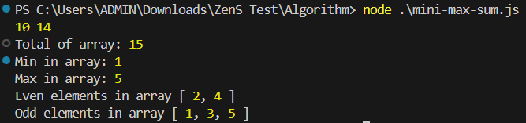

# Mini-Max-Sum
## How to run
- Open terminal
- Go to folder Algorithm
```bash
    cd .\Algorithm
```
- Input string to **INPUT-VALUE**
- Run in terminal by this command
```bash
    node .\mini-max-sum.js
```
## Failure cases
- Input is not a string
- Any value of input is not a number
- Amount of number is not five

## Example Result
